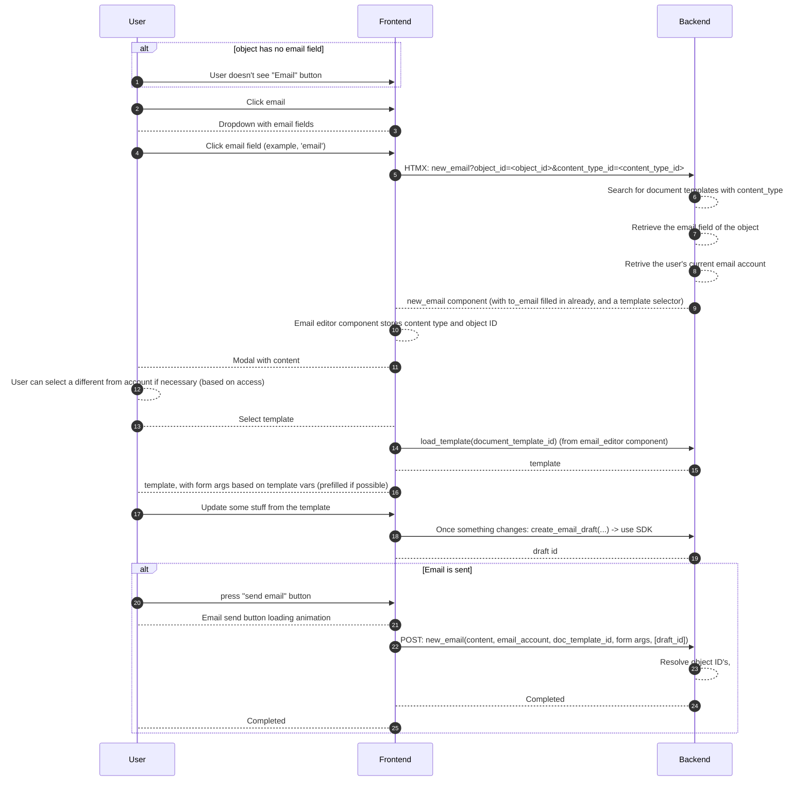

# Feature: Send email to object

This feature will:
- Enhance the email functionality
- Give users the ability to send emails using specific document templates
- Give users the ability to store email drafts and retrieve

## Notes
- We want to re-use the send_email endpoint for this, so that this will also work from the regular inbox
- Content that is overriden in the editor should override the document template. The only reason I can think of that the doc template is needed in the send_email endpoint is to resolve the content types
- The EmailEditor.ts should remain the sending part
- The button should be in the sidebar of the detail view, next to create todo
  - If the object has no email field, button shouldn't show

## Extra changes

- We need to be able to store the selected/default email account for a user. This should be a one-to-one field to from user to email account. Permissions should apply
- There should be an option in the create email account wizard to set it as the default email account
  - This selection should be changable via profile view
- EmailDraft model: very light internal model to store email drafts
- 