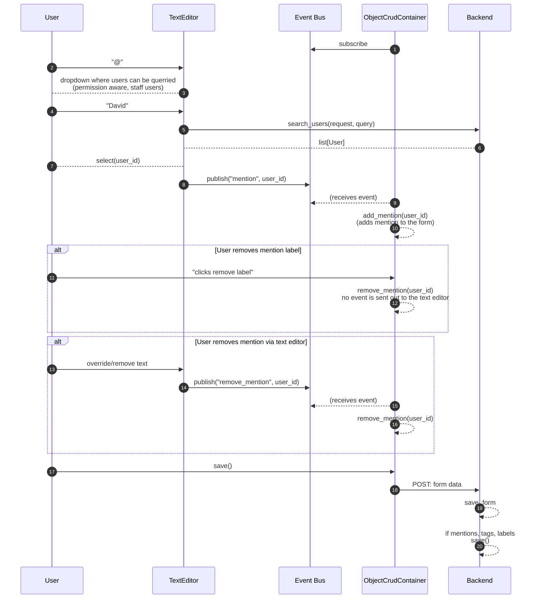
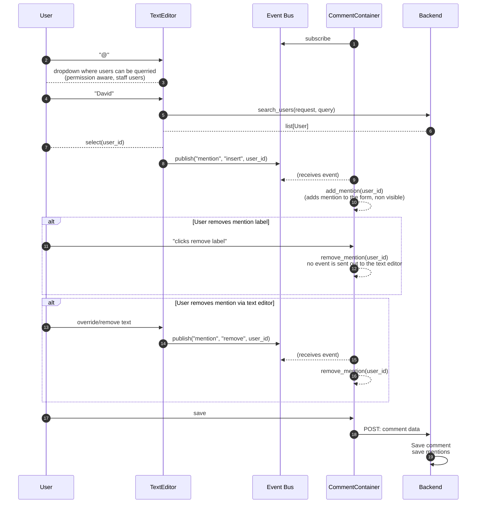
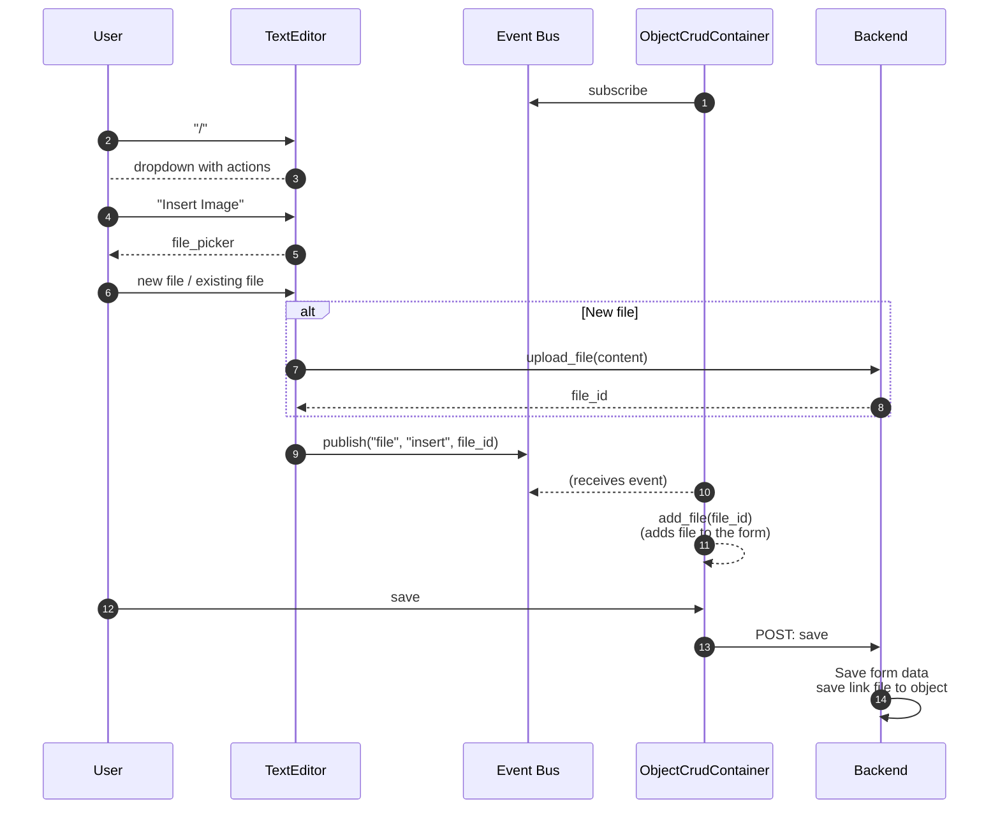
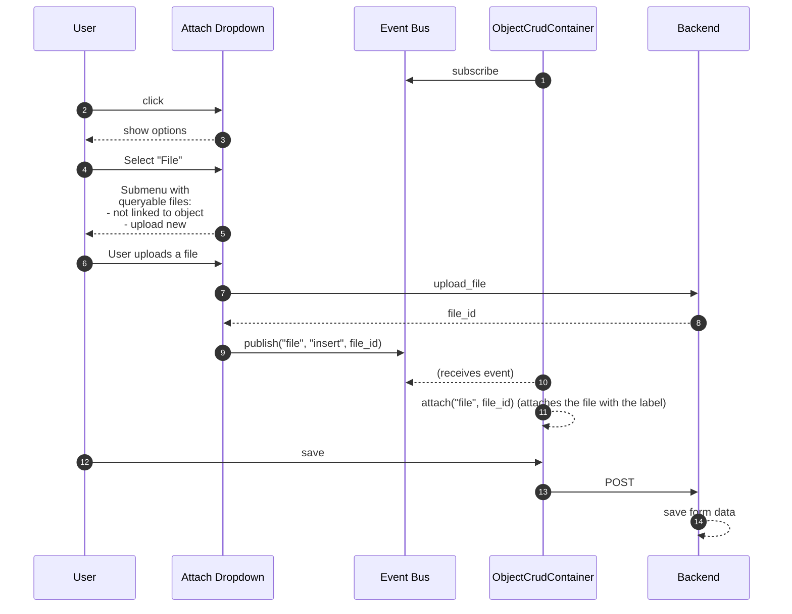

# Tags, mentions, labels, file references, image references

## Goal
- Make it possible for users to attach labels, mentions, tags to objects
- Make it possible for users to insert images into text editor fields, without having to save the binary.
- 


## Models

There will be a couple new models:
- Tag: refers to a object tagging anohter object
- Mention: refers to a user being mentioned in an object
- Label: refers to a label being attached to an object
- ObjectLabel

```mermaid
erDiagram

Object {

}

Mention {
    str id
    str user_id FK
    str object_id FK
    str content_type_id FK
    str? application_field FK
}

Tag {
    int source_content_type_id FK
    str source_object_id
    int target_content_type_id FK
    str target_object_id
}

Label {
    str id PK
    str name
    str color
}

ObjectLabel {
    str label_id
    int content_typ_id FK
    str object_id 
}
```

## Sequence

### Inserting a mention or tag via a text editor


### Inserting a mention a Comment Container


### Inserting an image via the text editor


### Inserting a file via the ObjectCrudContainer

This case describes what it would look like to insert a file via the object crud container. There should be a button, named "Tag" or "Attach", which launches a dropdown. This dropdown should have three options:
1. Avatar (for inserting an avatar, should be a basic file upload)
2. User (for mentions)
3. Object (for tags)
4. Label (for labels)
5. File (for files)

Once you click on an option, it should launch a submenu where you can query OR create new entries (in the case of a file/label)

#### Files
Right now, files are being attached using the files input. For now, it's okay for that field to stay, however, we also want to be able to attach files using the attach button.




#### Mentions, tags, labels

The more or less the same process should be followed by attach for mentions, objects, and labels. The only difference is that they won't have to make a call on upload. The form itself handles saving and reconciling the records.

### Advantages of using of the pub sub architecture.

We could easily envision a future where attaching a label/file/... should also show elsewhere, for example in the object detail sidebar. In that case, we only need to subscribe to that event and handle changes.

## Extra points of consideration

### Files

#### Anonymous/users without permission accessing files

We can imagine a situation where the text editor is used on a Blog model which is publicly accessible. The follows:
1. Admin/staff user creates a blog and inserts an image in the content
2. Unauthenticated user goes to landing page -> blogs -> blog-1-with-image
3. Since the text editor tag for the image is something like , we need to be able to publicly authorize this.

My suggestion for this is that if an image (or later maybe file) is attached to a particular field, which in this case would be "content", we would additionally store a reference via the **FileFieldReference** model. If we'd then allow via api_settings public read access on the Blog's content, than when trying to access the file, it should authorize.

#### Stale files due to draft deletion/file removal

If we're working on a new object, and use the upload_file endpoint whithout giving a content type ID or object ID, it should save the file, but mark it as "persisted=False". Once the file is actually saved, it should persist the file.

For stale files, we can later introduce a daily job to delete them, but that is out of scope for now.

### Labels

Right now, we still have labels, for example on models like Todo. Overtime, we want to make a migration effort of this into the new Label model structure. This however is not in scope for this item.


